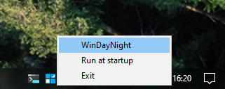

# WinDayNight
### Windows theme toggler
### [<ins>> Download <</ins>](https://github.com/WalterPlinge/windaynight/releases/download/v1.1.0/windaynight.exe)

A little tray app that toggles Windows' theme.
Just click the icon to toggle the theme! 
It sets both the System and App theme. 
It can be set to show in the tray at startup. 

When using it from the command line, a script, or Windows task scheduler, you can pass `toggle`, `light` or `dark` as an argument to control its behaviour (no argument will launch the tray app).

How to build:
- Make sure you have MSVC (other toolchains not tested) and Windows SDK
- run `build.cmd`
